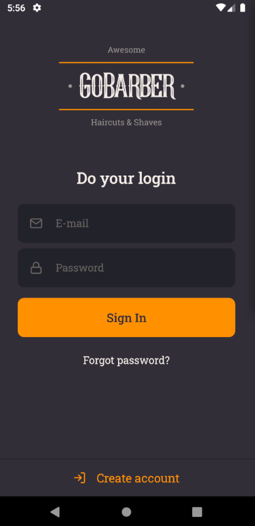
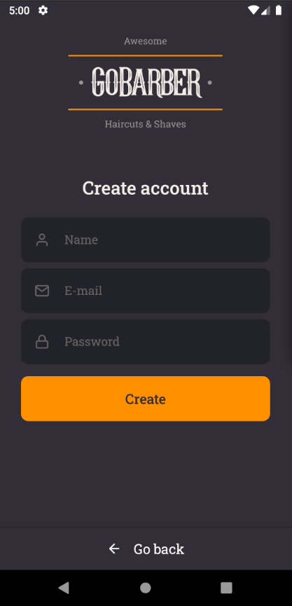

# GoBarber Web

Project developed copying the instructor coding during the Rocketseat Bootcamp Course.

This is the GoBarber's Mobile Application to manage barbershop scheduling.

## What I learned in this project?
  - Use react navigation and create a stack navigation.
  - Mobile application has Pixel Density concept, that need to each image 3 image with different resolution. The 1x image, named as <image-name>.png; the 2x image, named <image-name>@2x.png and the 3x image, named as <image-name>@3x.png. The Image component, from react-native, will choose the image that will be used depending on the smartphone density.
  - Use external fonts and how use icons.
  - There is the react-native-iphone-x-helper library to help create styles that better fit to IOS. Also exists the Platform component, inside of react-native library, that help create styles to each mobile platform.
  - React-native library has the KeyboardAvoidingView component to surround the components that should't be overlapping by the keyboard when it is shown.
  - Known some attributes and functions of the TextInput: KeyboardType, AutoCorrect, AutoCapitalize, ReturnKeyType, OnSubmitEdition.
  - UseImperativeHandle hook provides a way to change the ref object created by a father component inside a child component.

## What I did in this project?
  - Created the project, installed the app inside of the emulator and executed them.
  - Wrote a documentation to create and execute a mobile application.
  - Configured lint tools and created a StatusBar element to my app.
  - Created pages, routes and configure react navigation.
  - Created the SignIn screen.
  - Created the SignUp screen, changed the screens to adjust when the keyboard is shown, configured the navigation through the screens.
  - Added the Unform library to manage form on SignIn and SignUp screens.
  - Configured the input type and keyboard on SignIn and SignUp screens.
  - Created input style based on whether the field is focused or filled.
  - Created the form validations.
  - Integrated the SignUp screen with the API. I also created the auth hooks and integrated them with SignIn screen.
  - Separate authorization routes and create private routes.

## See the screenshots

